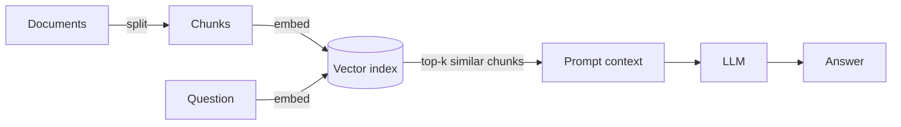

# Lesson 1 — Why RAG, and Where Vanilla RAG Breaks

> Workshop segment: opening 30 minutes — the finished chatbot demo, then the
> motivation for everything that follows.

## Why LLMs need grounding

A large language model alone is a closed book with a confident voice. Three
failure modes make it unsuitable for factual applications out of the box:

1. **Hallucination** — the model fills gaps with plausible fabrications, and
   the fabrication reads exactly as fluently as the truth.
2. **Stale knowledge** — the model knows nothing after its training cutoff.
3. **Private data** — your documents, tickets, contracts, and wikis were
   never in the training set at all.

Retrieval-Augmented Generation (RAG) addresses all three by changing the
question we ask the model. Instead of *"answer this,"* we ask *"answer this
using only the evidence I'm handing you."* The model becomes a reader, not
an oracle.

## The vanilla RAG loop



Four verbs: **chunk → embed → retrieve → generate.**

- *Chunk*: split documents into passages small enough to embed and stuff
  into a prompt (see `graphrag/ingest.py` — we split on paragraphs, never
  mid-sentence).
- *Embed*: map each chunk to a vector so that "similar meaning" becomes
  "nearby in vector space".
- *Retrieve*: embed the question, take the k nearest chunks by cosine
  similarity (`graphrag/vector_store.py`).
- *Generate*: prompt the LLM with the question plus those chunks.

This works remarkably well for questions whose answer *lives inside one
chunk*. "What is Note G?" retrieves the paragraph about Note G, and the
model paraphrases it. Done.

## Where it breaks

Vector similarity is a *lexical-semantic* signal. It finds text that sounds
like the question. It has no concept of *things* or *relationships between
things*. That produces four systematic failures:

### 1. Multi-hop questions

> "Who translated the paper that Luigi Menabrea wrote?"

The answer requires composing two facts:
`Menabrea —WROTE→ paper` and `Lovelace —TRANSLATED→ paper`.
If those facts live in different chunks (they usually do), no single
retrieved passage contains the full chain, and top-k similarity has no
mechanism to *follow* the connection from one chunk to the next.

### 2. Relationship questions

> "How are Charles Babbage and the Jacquard loom connected?"

The connection (Babbage's Analytical Engine borrowed the loom's punched-card
input) is a *path through entities*, not a passage of text. Vector search
returns chunks about Babbage and chunks about the loom, and leaves the
model to guess the join.

### 3. Aggregations

> "Which machines did Babbage design?"

Completeness requires *enumerating edges*, not finding one similar passage.
Top-k retrieval might return three chunks that all mention the Difference
Engine and none that mention the Analytical Engine.

### 4. Explainability

When a vector-RAG answer is wrong, your audit trail is "these five chunks
were cosine-similar to the question." There is no per-claim provenance —
nothing that says *this* assertion rests on *that* sentence.

## The thesis of this course

Keep vector search — it's genuinely good at "find me the passage that talks
about X." Add a second retrieval substrate that models **entities and typed
relations** explicitly: a knowledge graph. Route relationship-shaped
questions through graph traversal, description-shaped questions through
vector search, and fuse both into a grounded prompt.

That is GraphRAG, and by lesson 6 you will have built all of it.

## Try it

```bash
# The failure in action: this multi-hop question is answered correctly
# because the graph exists. Read the trace to see the two-hop chain.
python -m graphrag.chatbot --ask "Who translated the paper that Luigi Menabrea wrote?"
```

## Exercise

Ask the chatbot a question whose answer genuinely isn't in the corpus
("What is the airspeed velocity of an unladen swallow?"). Observe that the
offline answerer *says* it has no graph facts rather than inventing an
answer. That refusal behavior is a design choice you'll implement in
lesson 6.
