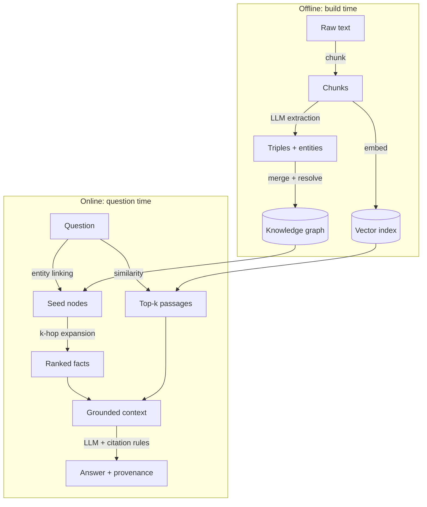

# Lesson 2 — Knowledge Graphs and the GraphRAG Architecture

> Workshop segment: ~30 minutes — the conceptual reframe, and the
> architecture you'll spend the rest of the session building.

## The reframe: entities and typed relations as the retrieval substrate

A **knowledge graph** stores facts as a *property graph*:

- **Nodes** are entities, each with a *type* — `(:Person {name: "Ada
  Lovelace"})`, `(:Machine {name: "Analytical Engine"})`.
- **Edges** are typed, directed relationships —
  `(ada)-[:TRANSLATED]->(paper)`.
- Both can carry **properties**. Ours carry the two that matter most in
  production: `evidence` (the quote supporting the fact) and `sources`
  (the chunks it was extracted from).

The atomic unit is the **triple**: `(subject, predicate, object)`.

```
(Luigi Menabrea) -[WROTE]->      (Sketch of the Analytical Engine)
(Ada Lovelace)   -[TRANSLATED]-> (Sketch of the Analytical Engine)
(Ada Lovelace)   -[WROTE]->      (Note G)
```

Notice what happened to the multi-hop question from lesson 1: *"Who
translated the paper that Menabrea wrote?"* is now a **two-edge path**, and
paths are exactly what graphs are fast at. The question that defeated
cosine similarity becomes a mechanical traversal.

## The full GraphRAG architecture



In one line: **text → triples → graph → query → grounded generation.**

Map it to the code you'll study:

| Stage | Module | Lesson |
|---|---|---|
| Chunking | `graphrag/ingest.py` | 1 |
| Triple extraction | `graphrag/extract.py` | 3 |
| Graph store + Cypher export | `graphrag/graph_store.py` | 4 |
| Embeddings + vector index | `graphrag/vector_store.py` | 5 |
| Hybrid retrieval | `graphrag/retrieve.py` | 5 |
| Grounded generation | `graphrag/generate.py` | 6 |
| Chatbot | `graphrag/chatbot.py` | 6 |

## Graph retrieval vs. vector retrieval

| | Vector search | Graph traversal |
|---|---|---|
| Finds | passages that *sound like* the question | facts *connected to* the question's entities |
| Great at | descriptions, definitions, fuzzy phrasing | multi-hop chains, relationships, aggregations |
| Weak at | connections spanning chunks | fuzzy phrasing with no recognizable entity |
| Provenance | "these chunks were similar" | per-edge evidence and source |
| Failure mode | plausible-but-wrong chunk | missing entity ⇒ empty result |

The last row is why production systems use **both**. Graph retrieval fails
*loudly* (no seed entity → no facts), vector retrieval fails *quietly*
(always returns something, relevant or not). Hybrid retrieval lets each
cover the other's blind spot — lesson 5 implements the fusion.

## When GraphRAG earns its complexity

GraphRAG is not free: you pay an extraction pass over every document and
you take on schema governance (lesson 7). It pays for itself when:

- Questions are **relational** — "who worked with whom", "what depends on
  what", supply chains, org charts, citation networks, incident timelines.
- Answers must be **explainable** — regulated domains, anything customer-
  facing where "why did it say that?" is a support ticket.
- The corpus has **recurring entities** that many documents mention — the
  graph accumulates cross-document knowledge that no single chunk holds.

If your questions are all "summarize this document", stay with vector RAG.

## Exercise

Sketch (on paper) the triples you'd extract from this sentence, including
entity types:

> "In 1991 the Science Museum in London completed Difference Engine No. 2
> from Babbage's original drawings."

Then compare with the `BUILT` edge in `data/annotations/triples.json`. Did
you also extract a `DESIGNED`-ish edge from "Babbage's original drawings"?
Was your predicate in the schema? That tension is lesson 3.
