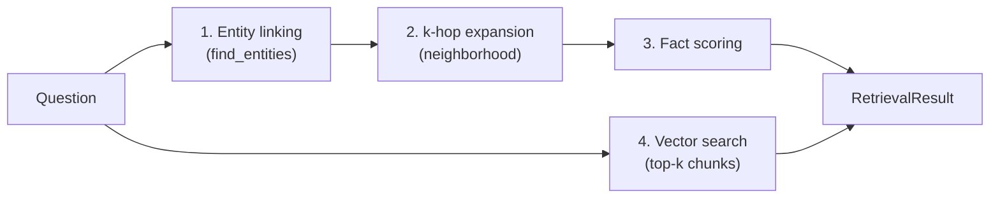

# Lesson 5 — Hybrid Retrieval: Graph Traversal + Semantic Search

> Workshop segment: ~45 minutes, second hands-on block — the retrieval
> engine that makes multi-hop questions answerable.

## The recipe

`graphrag/retrieve.py` runs four steps per question:



### Step 1 — Entity linking

`graph.find_entities("Who translated the paper that Luigi Menabrea wrote?")`
matches names and aliases on word boundaries → seeds: `{Luigi Menabrea}`.

This is deliberately the simplest linker that works. Production upgrades:
fuzzy matching for typos, embedding-based linking for paraphrases ("the
Italian engineer" → Menabrea), and an LLM linking pass for hard cases. But
the *shape* is identical: question text in, node ids out.

### Step 2 — k-hop expansion

From the seeds, collect every edge within `graph_hops` (default 2):

```
hop 1:  menabrea -[WROTE]-> paper
hop 2:  ada -[TRANSLATED]-> paper        <- the answer enters the pool
hop 2:  paper -[DESCRIBES]-> analytical_engine
```

The answer fact was **not similar to the question** — no shared rare words,
different sentence, different document. It entered the candidate pool
purely by *being connected*. That is the mechanism vector search lacks, in
one line of BFS.

Hops are a precision/recall dial: 1 hop misses multi-hop answers, 3+ hops
drag in half the graph. Start at 2; measure on your own question set.

### Step 3 — Fact scoring

The subgraph can still be large, so rank facts by lexical affinity:

```python
score = 3.0 * |question_tokens ∩ predicate_tokens|   # "translated" ~ TRANSLATED
      + 1.0 * |question_tokens ∩ entity_name_tokens| # mentions of the endpoints
```

The predicate weight dominates by design: the **verb of the question is the
strongest signal for which edge type answers it**. "Who *translated*..."
should surface `TRANSLATED` edges above `WROTE` edges even though the
`WROTE` edge touches the seed directly. Run the `:why` trace and you'll see
exactly this ordering.

Production systems replace this with embedding similarity over verbalized
triples, or skip scoring entirely by having an LLM write a Cypher query
(text-to-Cypher). The tradeoff triangle: lexical scoring is transparent and
fast; embeddings are robust to paraphrase; text-to-Cypher is the most
powerful and the most fragile (lesson 7 covers its injection risk).

### Step 4 — Vector search, and why it stays

The same question also goes through the vector index for top-k chunks.
Two reasons the graph never travels alone:

1. **Narrative context.** Facts are skeletal; the chunk provides the prose
   ("...ran to roughly three times the length of the original paper") that
   makes generated answers informative rather than telegraphic.
2. **Graceful degradation.** Ask about something with no linkable entity
   and the graph returns *nothing* — loudly. The vector side still returns
   its best passages, so the system degrades to vanilla RAG instead of
   failing. Try it:

```bash
python -m graphrag.chatbot --ask "What was Victorian engineering like?"
```

## Fusion patterns

We use the simplest fusion: hand *both* fact lists and chunk lists to the
generator, clearly labeled. Alternatives you'll meet in the wild:

| Pattern | Idea | When |
|---|---|---|
| **Union (ours)** | facts + chunks side by side in the prompt | default; lets the LLM weigh both |
| **Graph-first** | traverse, then fetch the chunks *cited by* the winning edges | tight token budgets |
| **Vector-first** | retrieve chunks, expand the entities they mention | questions with no linkable entity |
| **Router** | classify the question (relational vs. descriptive), pick one path | latency-sensitive systems |

## Watch a multi-hop retrieval happen

```bash
python -m graphrag.chatbot
you> Which professor at Cambridge designed the machine that Ada Lovelace wrote about?
you> :why
```

The trace shows: seeds `{University of Cambridge, Ada Lovelace}` → 2-hop
subgraph → `PROFESSOR_AT` and `DESIGNED` edges outscoring the rest → answer
entity Charles Babbage — with evidence quotes and source chunks per fact.
Three hops of reasoning, zero LLM calls, fully auditable.

## Exercises

1. Set `--hops 1` and re-ask the Menabrea question. Explain the failure
   from the trace.
2. Ask the same question with only vector retrieval (set `graph_hops = 0`
   in `Settings`, or just read the chunk list in the trace): does the top
   chunk contain the full answer chain?
3. Add a `paper → Document` type hint: "Which document did Ada Lovelace
   translate?" Check whether the type filter in `generate.py` changes the
   candidate ranking (it maps "document"/"paper" → `Document`).
4. Implement graph-first fusion: return only chunks that appear in the
   provenance of the top 5 facts. Measure the context-size reduction.
